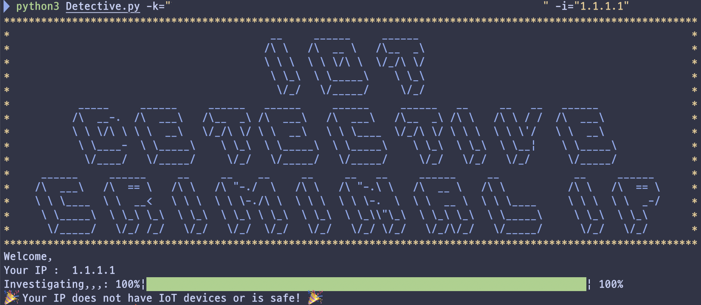
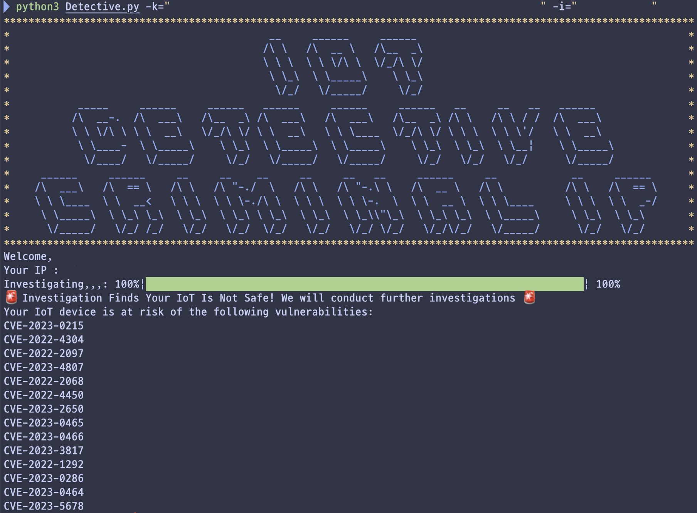

# 🕵🏻 IoT Detective Criminal IP 
IoT Detective Criminal ip uses Criminal IP to quickly check whether your IoT device is vulnerable or not!

### 🛠️ Requirement
---
- You need the **API Key of the [Criminal ip](https://www.criminalip.io/)**.
  - If you do not have a Criminal ip API KEY, please join the Criminal IP and get the Criminal ip API key issued !!
- The Python script was developed for **Python 3.12** version.

### 📝 Usage
---
```bash
git clone <https://github.com/elihypoo414/IoT-Detective-Criminal-IP.git>
cd IoT-Detective-Criminal-ip
pip3 install -r requirements.txt
python3 Detective.py -k=<CRIMINAL_IP_API_KEY> -i=<IoT_IP>
```

### 📄 Example
---
- **SAFE**
   
- **VULNERABLE**
    